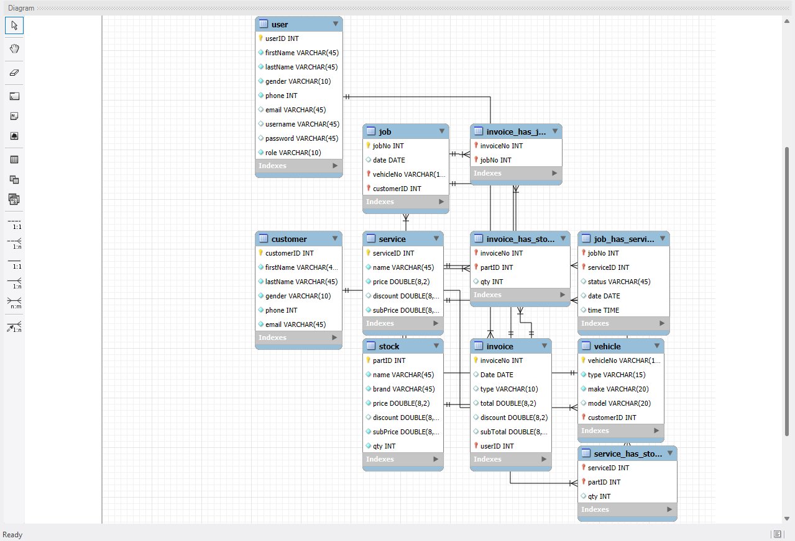
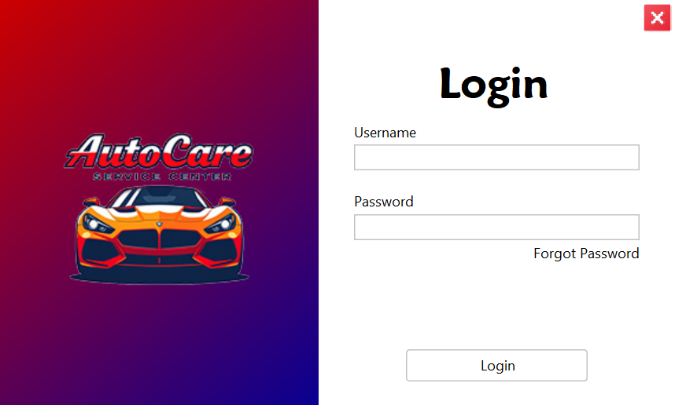
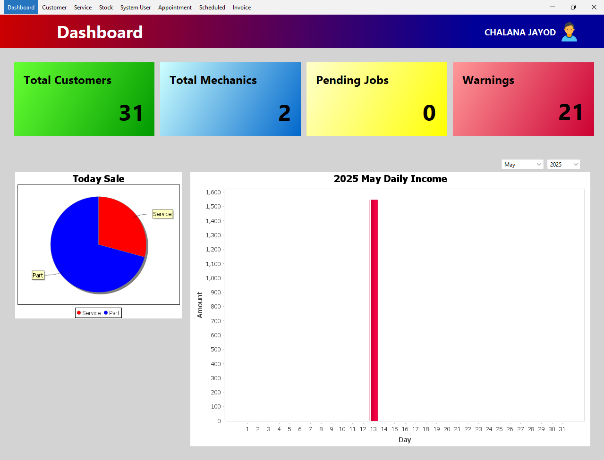
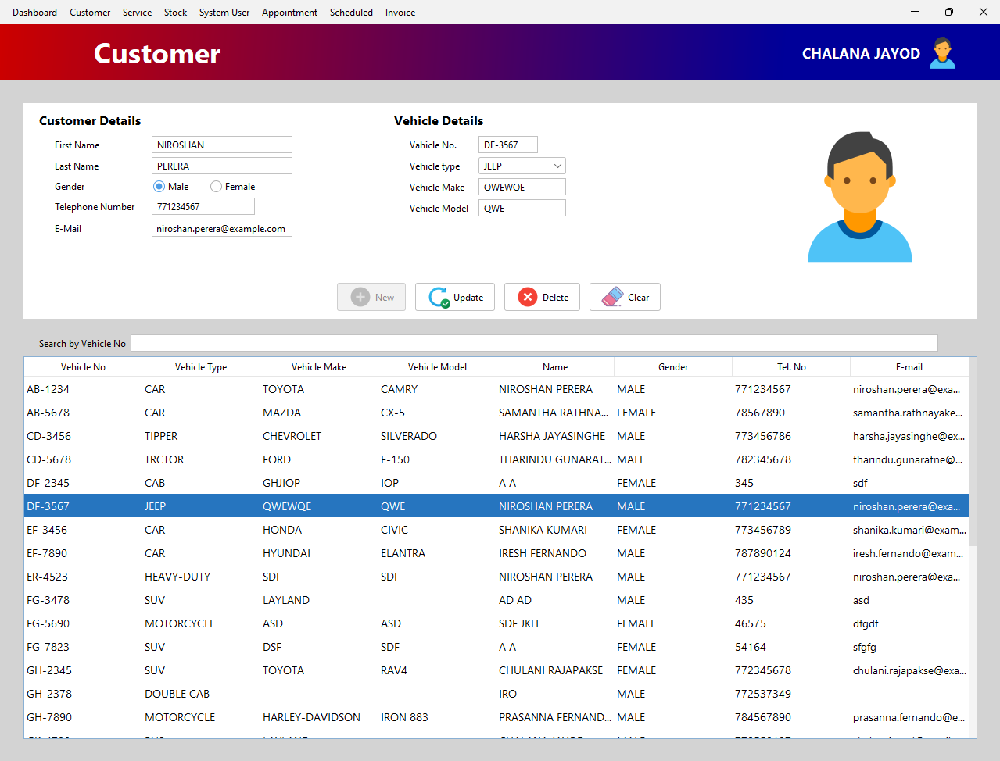
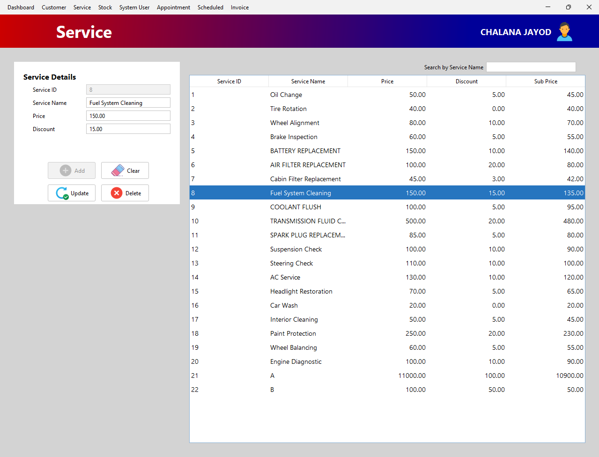
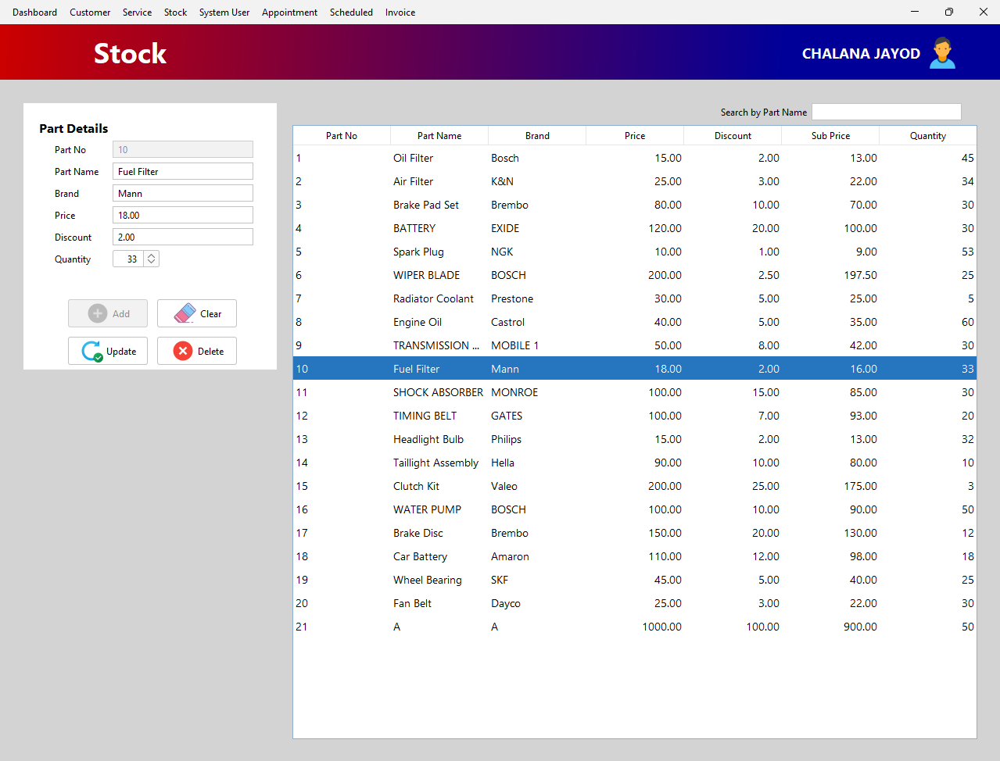
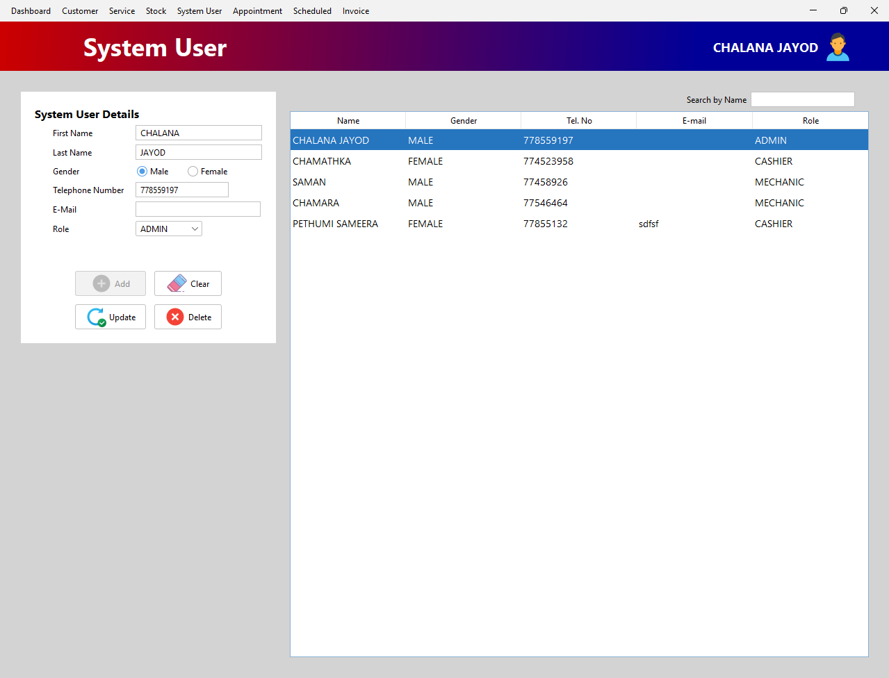
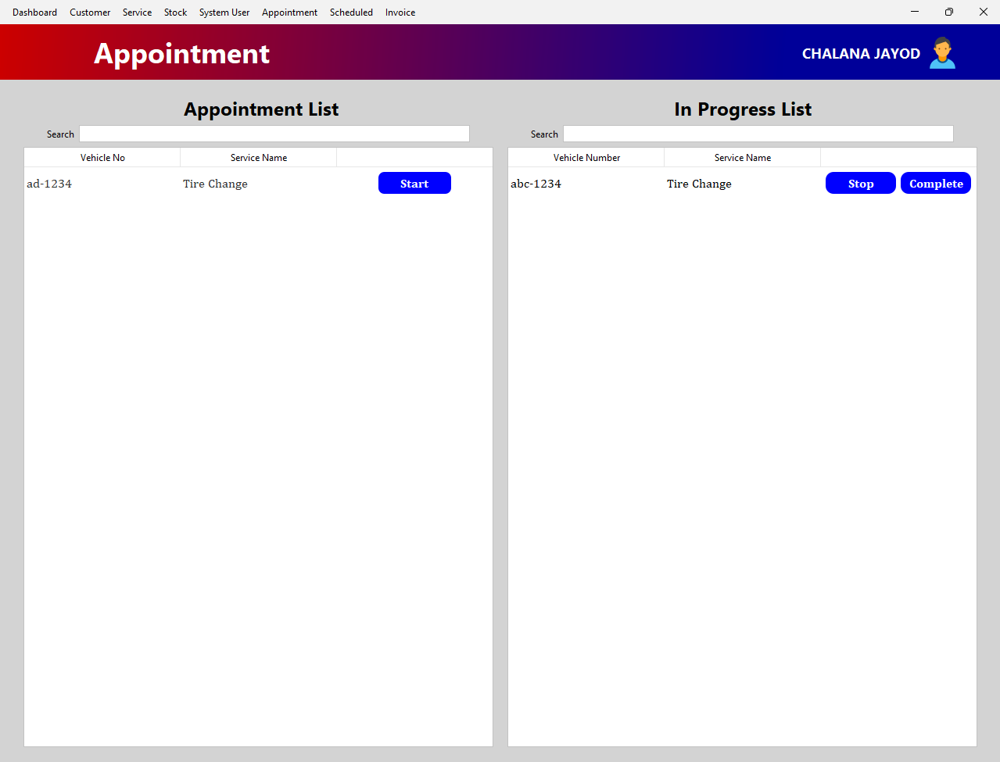
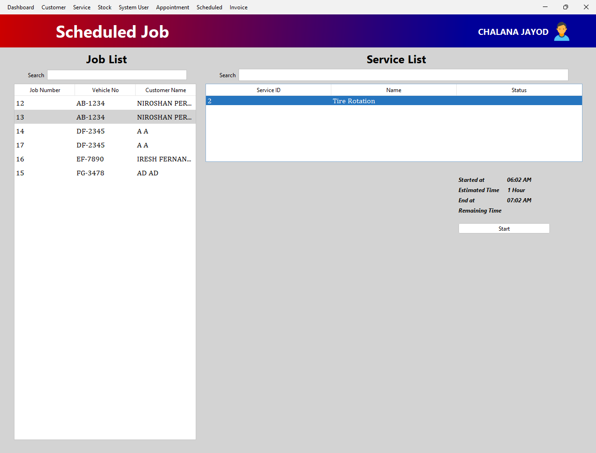
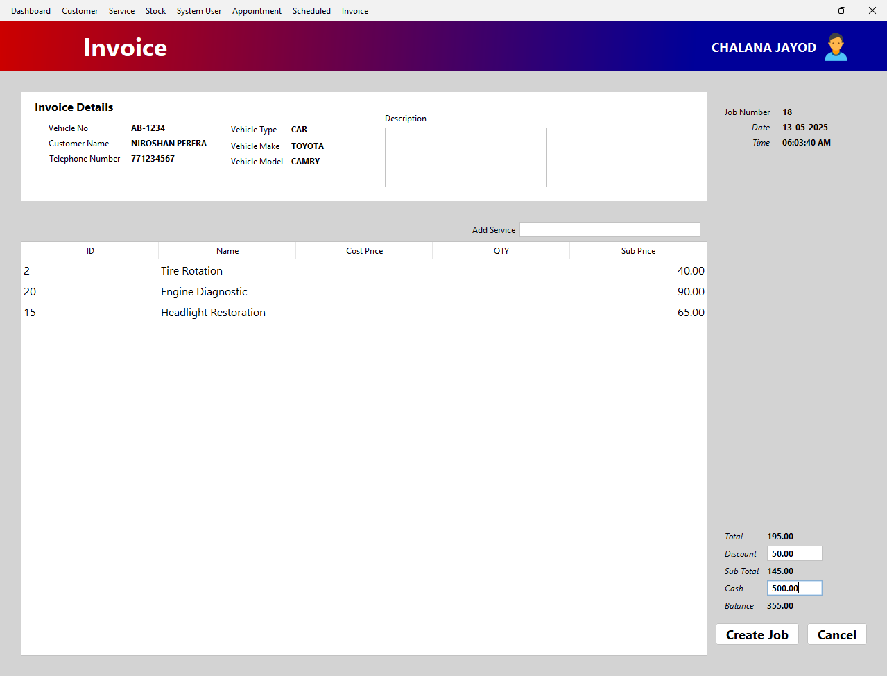

# Vehicle-Service-Management-System.Desktop

A comprehensive Java-based desktop application designed to manage a vehicle service center’s daily operations. The application empowers users to smoothly:
- Register and manage customers and vehicles
- Schedule service appointments
- Track and update vehicle service records
- Generate service-related reports

The project focuses on demonstrating strong object-oriented design, clean GUI integration, and fundamental database interaction.

---

## Technical Stacks
- Backend: MySQL database named vsms_local
- Frontend: Java (Swing-based desktop app), HTML/CSS/JS (web app)
- Platform: Windows Desktop
  
## Overview
- Built with Java using NetBeans and Swing
- Role-based access: Admin, Cashier, Mechanic
- Cashier: Register customer, vehicle, add services/spare parts, generate invoices
- Mechanic: Update status of services, including web-booked services
- Admin: Full control of services, stock, customers, and income reports
  
## Target Users
- Customers
- Cashiers: registers customers, adds services/spare parts, and generates invoices
- Mechanics: Mechanic updates service statuses (including web-added)
- Admins: Manage services, users, inventory, and monitor income, registers customers, adds services/spare parts, and generates invoices

## Modules Overview
1. Dashboard  
Admin can view count of  customers, mechanics, pending jobs, warning and daily/monthly/yearly income graphically

2. Customer  
Add, Update, Delete and view Customer vehicle details

3. Service  
Add, Update, Delete and view services details in the company

4. Stock  
Add, Update, Delete and view stock details in the company

5. System Users  
Manage Internal Staff giving Roles admin, cashier and mechanic

6. Appointment  
Change status of appointments create from web application by user. The only mechanic can change status that appointment.

7. Scheduled  
Show service status create from desktop application customer who came the service center

8. Invoice  
This section is important. In this here, generate the invoice and bring both completed services and buy spare parts.

## Database Design 

## UI
<table border=0>
  <tr>
    <td colspan=2></td>
  </tr>
  <tr>
    <td></td>
    <td></td>
  </tr>
  <tr>
    <td></td>
    <td></td>
  </tr>
  <tr>
    <td></td>
    <td></td>
  </tr>
  <tr>
    <td></td>
    <td></td>
  </tr>
</table>
